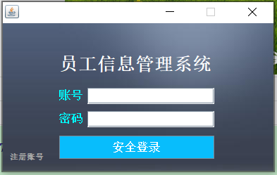
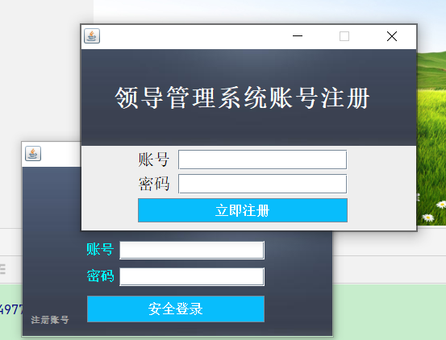
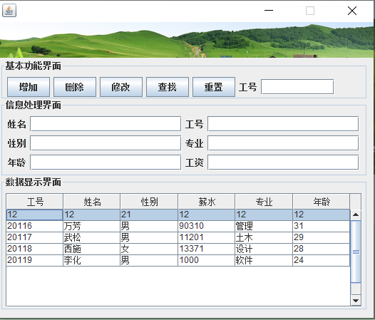

<h1 align="center">员工信息管理系统</h1>

## 简介
员工信息管理系统：角色分为领导和员工；登录注册、信息增删改查、账号管理、数据展示。简洁界面设计，方便用户进行身份验证和员工数据的管理。    --计算机毕业设计源码；毕设源码；java毕业设计源码

## 联系方式

<h3 align="center">获取完整代码与数据库文件 + 微信：deepguan QQ: 86050149 QQ群: 783742310</h3>

<h3 align="center">可帮忙远程部署 包运行成功！提供远程部署、修改代码、设计文档指导、代码讲解等服务！</h3>

## 功能介绍（完整见运行截图）
管理员：基本功能包括员工信息的增加、删除、修改和查找。用户可以通过注册和登录功能访问系统，并进行安全登录。界面设计简洁，支持用户高效管理员工数据。

用户：可以通过注册新账号或使用已有账号进行登录。登录后，用户能够查看和编辑个人信息，并通过系统提供的功能对员工信息进行管理和操作。

## 运行截图

本代码来源于网络,仅供学习参考使用!

